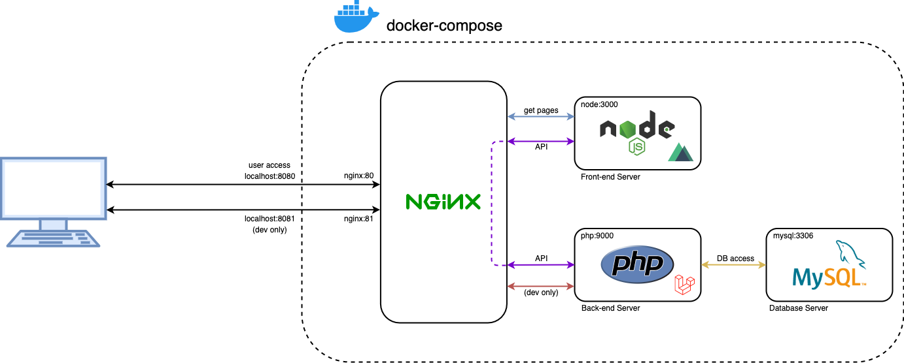

# Nuxt.js(universal) + Laravel API + Docker

## About
Docker template for Nuxt.js and Laravel API for SSR project.



## Stack includes
* Nuxt.JS (2.0.0 version) + Vuetify.js
* Laravel (6.9.0 version)
* Mysql 8.0
* Nginx

## Installation

**1. Clone the repository and enter its folder**
```
git clone https://github.com/hk206/nuxt-laravel-ssr.git your-app-folder
cd your-app-folder
```

**2. Copy environment files**
```
cp .env.example .env
cp .env.api api/.env
cp .env.client client/.env
```

**3. Build and up docker containers (It may take up to 10 minutes)**
```
docker-compose up -d --build
```

**4. Install composer dependencies**
```
docker-compose exec php composer install
```

**5. Set up laravel permissions**
```
sudo chmod -R 777 api/bootstrap/cache
sudo chmod -R 777 api/storage
```
**6. Generate Laravel's APP Key**
```
docker-compose exec php php artisan key:generate
```

**7. Restart the containers**
```
docker-compose restart
```

Now, you can access the URLs http://localhost:8080 for Nuxt.js and http://localhost:8081 for Laravel.

If you see the 502 error page, just wait a bit when yarn install && yarn dev process will be finished.

Enjoy your SSR Life!!

### あとで英語で追記するメモたち
* ホットリロードはデフォルトで有効になっているよ(設定はnuxt.config.jsに記載)
* nodeコンテナ立ち上げと同時にyarn installとyarn dev実行しているから自分で実行しなくていいよ
* clientとapiの中身はそれぞれnuxtとlaravelインストールしただけなので自分でやり直してもいいよ
* 8081ポートは一応用意したけど外部からAPI使う予定ないなら本番では閉じておこうね

